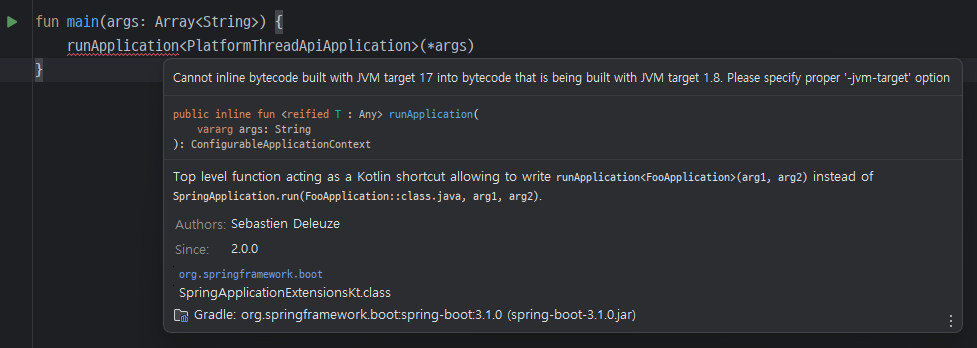
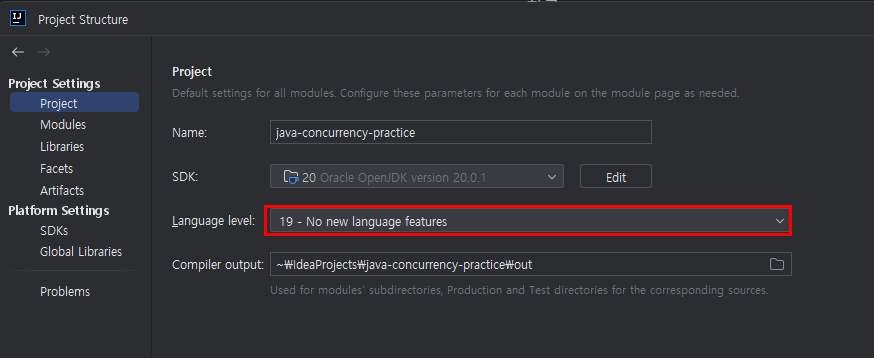

## 

## Version Compatibility

### [Gradle - Java - Kotlin](https://docs.gradle.org/current/userguide/compatibility.html)

- Gradle 8.0.2
- JVM 20
- Kotlin 1.9.0-Beta
- Spring Boot 3.1.0

참고
- https://youtrack.jetbrains.com/issue/KT-57669
  -  Kotlin 1.9.0-Beta 부터 JVM 20 지원

## Trouble Shooting

#### 
- project settings에서 Language Level 변경
- 